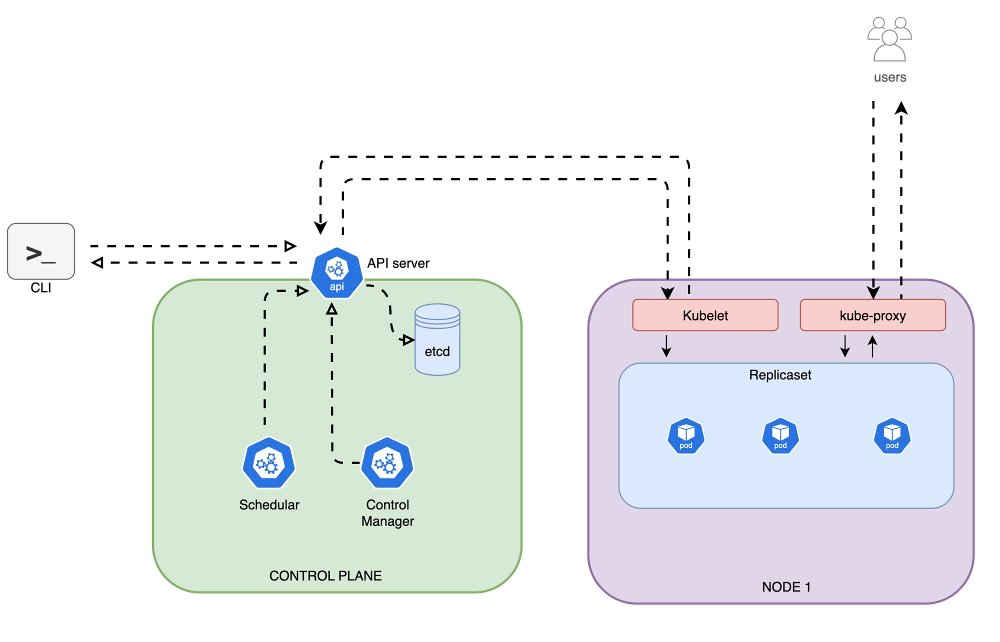

# Kube-Flow

A visual guide to understanding Kubernetes architecture and component relationships. This diagram helps developers and DevOps engineers understand how different parts of Kubernetes work together.

## Architecture Components

### Control Plane
The control plane is responsible for making global decisions about the cluster and detecting/responding to cluster events.

Components:
- **API Server**: Front-end for the Kubernetes control plane handling all API requests
- **etcd**: Consistent and highly-available key-value store for all cluster data
- **Scheduler**: Watches for newly created Pods with no assigned node and selects a node for them to run on
- **Control Manager**: Runs controller processes that regulate the state of the cluster

### Node Components
Each node contains the services necessary to run Pods and is managed by the control plane.

Components:
- **Kubelet**: An agent that runs on each node ensuring containers are running in a Pod
- **Container Runtime Interface (CRI)**: The software responsible for running containers
- **Container Network Interface (CNI)**: Handles network communication between Pods
- **Kube Proxy**: Network proxy that maintains network rules on nodes

## Network Flow
The diagram illustrates how different components communicate:
- All communication flows through the Network layer
- API Server acts as the hub for control plane communication
- Nodes communicate with the control plane through the kubelet and kube-proxy
- etcd stores all cluster state and configuration

## Purpose

This visualization aims to:
- Provide clear understanding of Kubernetes architecture
- Show component relationships and dependencies
- Illustrate network communication paths
- Help in troubleshooting and system design

## Support My Work

If you find this Kubernetes architecture visualization helpful, you can support my work:

## License

This project is licensed under the MIT License - see the [LICENSE](LICENSE) file for details.

## Acknowledgments

- Kubernetes Documentation
- Cloud Native Computing Foundation (CNCF)
- Kubernetes Community
